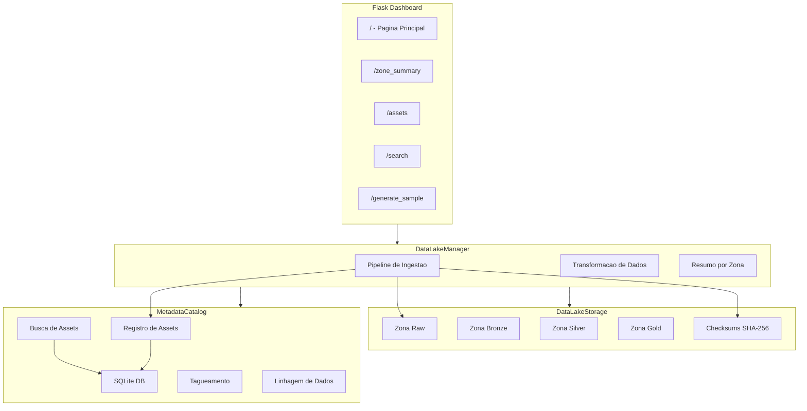
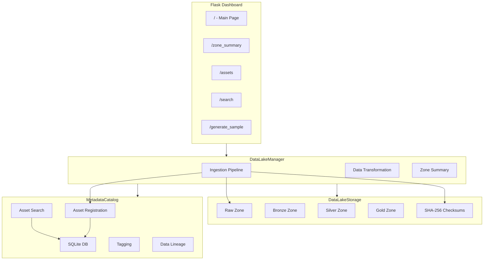

# Data-Lake-Architecture

<div align="center">


</div>


[Portugues](#portugues) | [English](#english)

---

## Portugues

### Descricao

Implementacao de arquitetura de Data Lake em Python com zonas de armazenamento (raw/processed/curated), catalogo de metadados SQLite e dashboard Flask para gerenciamento de assets.

### O que este projeto faz

- Armazenamento de dados em multiplas zonas (raw, bronze, silver, gold) no sistema de arquivos local
- Catalogo de metadados com SQLite para registro, busca e tagueamento de assets
- Ingestao de dados com checksums SHA-256 para integridade de arquivos
- Busca e tagueamento de assets de dados
- Dashboard web Flask para navegacao, busca e ingestao de dados
- Geracao de dados de exemplo (clientes e transacoes)
- Suporte a formatos Parquet, CSV e JSON
- Rastreamento de linhagem de dados entre assets

### O que este projeto NAO possui

- Processamento paralelo ou distribuido
- Validacao de schema
- Alertas ou monitoramento
- Configuracao via YAML/JSON
- Containerizacao (Docker)
- CI/CD
- Testes abrangentes (apenas scaffold)

### Tecnologias

| Tecnologia | Descricao | Papel |
|------------|-----------|-------|
| **Python** | Linguagem principal | Core |
| **Flask** | Framework web leve | Dashboard web |
| **pandas** | Biblioteca de manipulacao de dados | Leitura/escrita de dados |
| **SQLite** | Banco de dados embutido | Catalogo de metadados |
| **pyarrow** | Motor Apache Arrow | Suporte a formato Parquet |
| **numpy** | Computacao numerica | Geracao de dados de exemplo |

### Arquitetura



### Como Executar

```bash
# Clonar o repositorio
git clone https://github.com/galafis/Data-Lake-Architecture.git
cd Data-Lake-Architecture

# Criar e ativar ambiente virtual
python -m venv venv
source venv/bin/activate  # No Windows: venv\Scripts\activate

# Instalar dependencias
pip install -r requirements.txt

# Executar a aplicacao
python data_lake.py
```

O servidor Flask sera iniciado em `http://localhost:5000`.

### Estrutura do Projeto

```
Data-Lake-Architecture/
├── tests/              # Scaffold de testes
│   ├── __init__.py
│   └── test_main.py
├── LICENSE
├── README.md
├── data_lake.py        # Modulo principal (toda a logica)
└── requirements.txt
```

### Testes

O diretorio `tests/` contem apenas um scaffold basico. Nao ha testes unitarios abrangentes implementados.

```bash
pytest tests/ -v
```

---

## English

### Description

Data Lake architecture implementation in Python with storage zones (raw/processed/curated), SQLite metadata catalog, and Flask dashboard for asset management.

### What this project does

- Multi-zone data storage (raw, bronze, silver, gold) on local filesystem
- Metadata catalog with SQLite for asset registration, search, and tagging
- Data ingestion with SHA-256 checksums for file integrity
- Data asset search and tagging
- Flask web dashboard for browsing, searching, and ingesting data
- Sample data generation (customers and transactions)
- Support for Parquet, CSV, and JSON formats
- Data lineage tracking between assets

### What this project does NOT have

- Parallel or distributed processing
- Schema validation
- Alerting or monitoring
- YAML/JSON configuration
- Containerization (Docker)
- CI/CD
- Comprehensive testing (scaffold only)

### Technologies

| Technology | Description | Role |
|------------|-------------|------|
| **Python** | Main language | Core |
| **Flask** | Lightweight web framework | Web dashboard |
| **pandas** | Data manipulation library | Data read/write |
| **SQLite** | Embedded database | Metadata catalog |
| **pyarrow** | Apache Arrow engine | Parquet format support |
| **numpy** | Numerical computing | Sample data generation |

### Architecture



### How to Run

```bash
# Clone the repository
git clone https://github.com/galafis/Data-Lake-Architecture.git
cd Data-Lake-Architecture

# Create and activate virtual environment
python -m venv venv
source venv/bin/activate  # On Windows: venv\Scripts\activate

# Install dependencies
pip install -r requirements.txt

# Run the application
python data_lake.py
```

The Flask server will start at `http://localhost:5000`.

### Project Structure

```
Data-Lake-Architecture/
├── tests/              # Test scaffold
│   ├── __init__.py
│   └── test_main.py
├── LICENSE
├── README.md
├── data_lake.py        # Main module (all logic)
└── requirements.txt
```

### Tests

The `tests/` directory contains only a basic scaffold. There are no comprehensive unit tests implemented.

```bash
pytest tests/ -v
```

### Author

**Gabriel Demetrios Lafis**
- GitHub: [@galafis](https://github.com/galafis)
- LinkedIn: [Gabriel Demetrios Lafis](https://linkedin.com/in/gabriel-demetrios-lafis)

### License

This project is licensed under the MIT License - see the [LICENSE](LICENSE) file for details.
